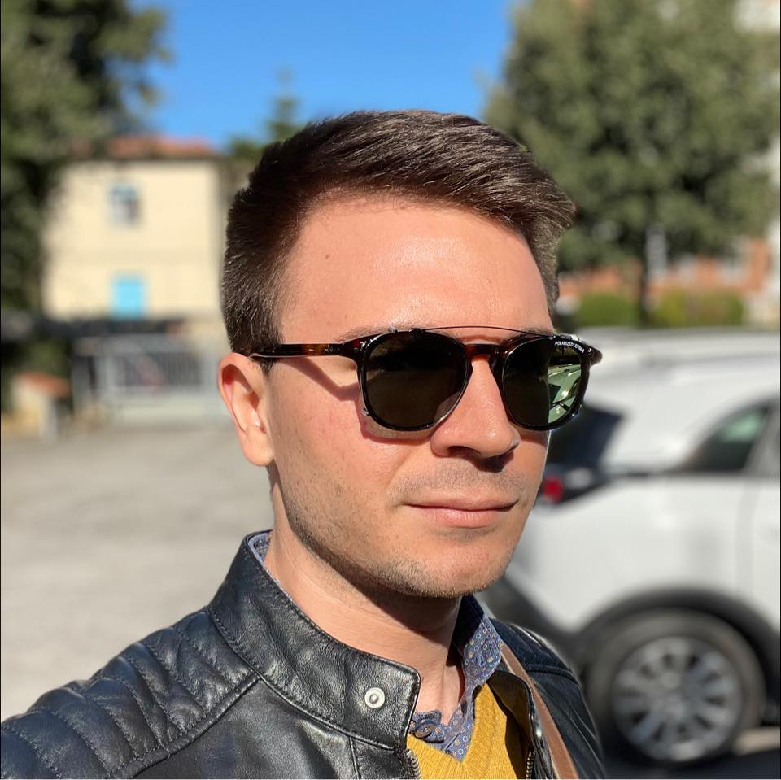

Hello! I am Gabriele Ara.

<figure id="about-profile">
  

    
  

  <figcaption class='caption'>A nice picture of me</figcaption>
</figure>

<!-- ## I'm looking for a new occupation -->

<a class='md-button md-button--primary upper' href='curriculum.html'>
  Check out my Resume
</a>

## Quick bits

I was born in 1994 in Livorno, Italy.
Ever since I was little, I was fascinated by everything that revolved around computers and such. I made it my life mission to learn everything I could about computers, how to use them and how they worked, hoping that I'd be good enough to work with them someday.

## Current occupation

Currently, I'm a Postdoctoral Researcher at [Scuola Superiore Sant'Anna](http://www.santannapisa.it) in Pisa, Italy. I proudly work in the [Real-Time Systems Laboratory (ReTiS Lab)](http://retis.santannapisa.it) under the supervision of [Prof. Tommaso Cucinotta](http://retis.sssup.it/~tommaso).

My research activity focuses in [Emerging Digital Technologies](http://www.santannapisa.it/en/education/international-phd-course-emerging-digital-technologies) and Embedded Systems. In particular, I conduct research on the energy consumption of real-time tasks on embedded platforms, like ARM-based devices running Linux.

## Want more?

Stick around if you want to learn more, maybe checking out my [about](about) page.

Or maybe check out my full list of [research publications](publications).
